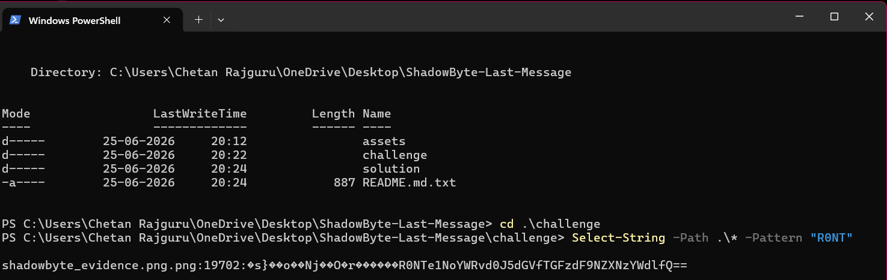

# Operation ShadowByte

## Category
Steganography / Digital Forensics

## Difficulty
Easy

## Scenario

A hacker known only as **ShadowByte** claimed to have hidden critical information inside an innocent-looking image before disappearing from the internet.

Authorities recovered a single image file but were unable to determine whether it contained any useful information.

Your mission is to investigate the evidence, uncover hidden data, and recover the flag.

---

## Files Provided

- shadowbyte_evidence.png
- hint.txt

---

## Learning Objectives

- File Analysis
- Hidden Data Discovery
- Base64 Decoding
- Digital Forensics Investigation

---

## Challenge Walkthrough

1. Analyze the provided image.
2. Search for hidden content inside the file.
3. Extract the encoded string.
4. Decode the string.
5. Recover the flag.

---

## Demonstration

### Hidden Data Extraction

---

## Tools Used

- Windows PowerShell
- CyberChef
- GitHub

---

## Skills Demonstrated

- Cybersecurity Fundamentals
- Digital Forensics
- Steganography Concepts
- Problem Solving

---

## Author

Chetan Rajguru